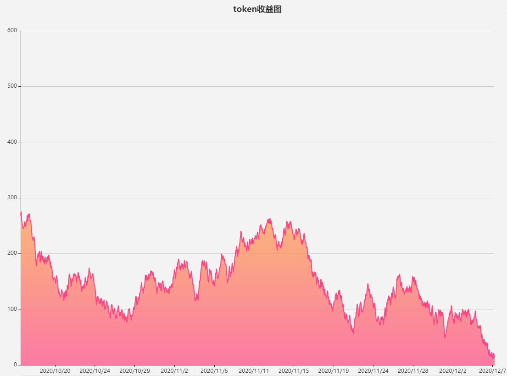

# 减半合约实验

### 减半逻辑和收益计算

1. 当管理员，通过notifyRewardAmount方法初始化第一期奖励数，并初始化相关参数
   - periodFinish: 用于记录下一期开始时间
   - rewardRate: 奖励速率，在同一期中该速率不变（例如第一期奖励token数为100，每分钟奖励1个token，不够用户是否存取都不变）
   - lastUpdateTime: 记录最后一次更新奖励的时间，在用户存取，获取奖励时，会触发方法更新该值，并更新每个token的收益数。
   - rewardPerTokenStored: 该值记录的是下图中的面积，也就是在某个时间段内每个token的奖励数。

token收益，如下图所示，横坐标为时间t,纵坐标为该时刻每个token的收益，面积为所有时间内每天token的收益



#### 部署合约
```javascript
const NewToken = artifacts.require("NewToken")
const BeeHoney = artifacts.require("BeeHoney")
const BeeHoneyRewards = artifacts.require("BeeHoneyRewards")

const MetaCoin = artifacts.require("MetaCoin");

module.exports = async function (deployer, network, accounts) {
    // 部署两个测试token
    // NewToken 用于默认需要存储的代币
    deployer.deploy(NewToken, "NewToken", "NT")
    let newToken = await NewToken.deployed()
    // 添加铸币者
    newToken.addMinter.call(accounts[0])
    // BeeHoney 用于奖励代币
    deployer.deploy(BeeHoney, "BeeHoney", "BHY")
    let beeHoney = await BeeHoney.deployed()

    // 部署减半合约
    deployer.deploy(BeeHoneyRewards, NewToken.address, BeeHoney.address)
    let beeHoneyRewards = await BeeHoneyRewards.deployed()

    // 将减半合约添加到BeeHoney的铸币者中
    beeHoney.addMinter.call(BeeHoneyRewards.address)
};

```

#### 测试功能
```javascript
let newToken = await NewToken.deployed()
let beeHoney = await BeeHoney.deployed()
let beeHoneyRewards = await BeeHoneyRewards.deployed()

// 给指定地址充值newToken代币,(1000 nt)
newToken.mint.call(accounts[0],"100000000000000000000")
// 执行减半合约的notifyRewardAmount方法，初始化相关参数
// 传入参数需要和合约中的initreward的值保持一致
// 总计2000BHY个奖励，按照每15分钟减半一次
// 也可自行修改，initreward和DURATION参数
beeHoneyRewards.notifyRewardAmount.call(1000 * 1e18)

// 授权合约账号
newToken.approve.call(accounts[0],"50000000000000000000")
// 存钱500 nt token
beeHoneyRewards.state.call("50000000000000000000")

// 获取奖励，发送到用户账号上
beeHoneyRewards.getReward.call()

// 获取用户奖励数
beeHoneyRewards.earned.call(accounts[0])
```